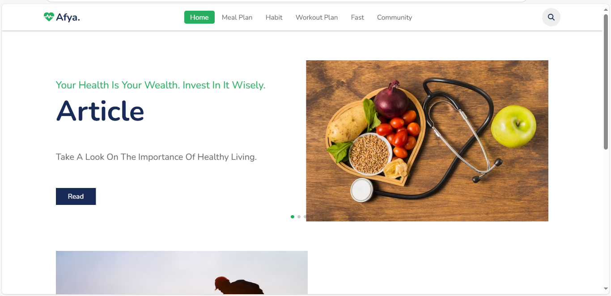

# Afya Centre - Health & Nutrition Platform

A comprehensive health and nutrition web application offering personalized diet plans, workout routines, and health resources.

## Features

- **Diet Plans**:
  - Keto diet plan
  - Carnivore diet plan
  - Lactating mother's plan
  - Children's nutrition plan
  - Cardiovascular health plan
  - Muscle gain plan

- **Workout Programs**:
  - HIIT workouts
  - Strength training
  - Home workouts
  - Cardiovascular exercises

- **Health Resources**:
  - Nutrition books (Atomic Habits, Obesity Code, Navy Seal)
  - Educational materials

- **User System**:
  - Account creation
  - Login functionality
  - Personalized recommendations

## Demo

### 1. Login


### 2. Home Page
The home page contains the latest health articles. To read an article click the "Read" button at the specific article.Below it is a holder for community support.



#### 2.1 Contact Form
Click "Get Support" to display the form.


### 3. Meal Plan Page
Contains meal plans for users to use.


A meal plan sample is shown below.


### 4. Habits Page
Contains productivity habits for users to engage in.


Click "Continue" to proceed with the specific activity.

#### 4.1 Read book example


To display the specific book just click on the book you want and scroll to read.


### 5. Workout Plan Page
This page contains various workout plans for users to use.


A sample workout is shown below.


### 6. Fasting Page
This page contains fasting plans for users to use. Click a specific fast type under "Choose Fast Type", click "Start" to start the countdown.


24hr fast example.


Fast started.


## File Structure

```
Afya Centre/
├── public/                 # Public assets
│   ├── css/                # Stylesheets
│   ├── html/               # HTML pages
│   ├── images/             # Image assets
│   ├── javascript/         # Client-side scripts
│   └── [PDF resources]     # Health books
├── Image png/              # Additional images
├── Images/                 # More image assets
├── app.js                  # Main application file
├── database.js             # Database configuration
├── package.json            # Project dependencies
└── [HTML pages]            # Various feature pages
```

## Technologies Used

- Frontend:
  - HTML5
  - CSS3
  - JavaScript

- Backend:
  - Node.js
  - Express.js
  - MySQL

- Additional:
  - Various npm packages (see package.json)

## License

ISC License (see package.json for details)
